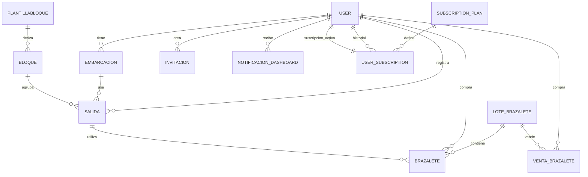

Mapa de BD y modelos (detalle por modelo)

1. Mapa conceptual de relaciones

2. Detalle por modelo

2.1 User (users)
Campos principales:
- id (UUID, PK)
- nombre, email, password
- telefono, avatar_url
- rol (CONANP, PRESTADOR)
- activo
- fechaVencimientoPermiso (DATEONLY)
- estadoPermiso, diasNotificacion, ultimaNotificacion (DATEONLY), motivoSuspension
- stripe_customer_id
- passwordResetToken, passwordResetExpires
- created_at, updated_at

Relaciones:
- 1:N con Embarcacion (prestador_id)
- 1:N con Salida (prestador_id)
- 1:N con Brazalete (prestador_id)
- 1:N con VentaBrazalete (prestador_id)
- 1:N con Invitacion (creada_por)
- 1:N con NotificacionDashboard (usuario_id)
- 1:N con UserSubscription (usuario_id)
- 1:1 con UserSubscription activa (scope)

2.2 Embarcacion (embarcaciones)
Campos principales:
- id (UUID, PK)
- nombre, matricula (unique)
- capacidad
- tipo (enum)
- estado (enum: disponible, en_uso, mantenimiento)
- prestador_id (FK users)
- created_at, updated_at

Relaciones:
- N:1 con User (prestador)
- 1:N con Salida (embarcacion_id)

2.3 Salida (salidas)
Campos principales:
- id (UUID, PK)
- prestador_id (FK users)
- embarcacion_id (FK embarcaciones)
- destino
- bloque_id (FK bloques, opcional)
- hora (TIME, opcional)
- fecha (DATEONLY)
- numero_pasajeros
- observaciones
- estado (enum)
- motivo_cancelacion
- created_at, updated_at

Relaciones:
- N:1 con User (prestador)
- N:1 con Embarcacion
- N:1 con Bloque
- 1:N con Brazalete (salida_id)

2.4 Bloque (bloques)
Campos principales:
- id (UUID, PK)
- nombre, hora_inicio, hora_fin (opcionales si es plantilla)
- capacidad_total (opcional si es plantilla)
- capacidad_registrada
- estado (enum)
- destino
- es_plantilla (boolean)
- plantilla_id (FK plantillas_bloque, opcional)
- fecha (DATEONLY, null si es plantilla)
- created_at, updated_at

Relaciones:
- N:1 con PlantillaBloque (cuando es_plantilla=true)
- 1:N con Salida (bloque_id)

2.5 PlantillaBloque (plantillas_bloque)
Campos principales:
- id (UUID, PK)
- nombre
- hora_inicio, hora_fin
- capacidad_total
- destino
- activa
- created_at, updated_at

Relaciones:
- 1:N con Bloque (plantilla_id)

2.6 LoteBrazalete (lotes_brazaletes)
Campos principales:
- id (UUID, PK)
- numero_lote (unique)
- cantidad_total, cantidad_disponibles, cantidad_vendidos, cantidad_utilizados
- tipo (universal)
- fecha_compra (DATEONLY)
- fecha_vencimiento (DATEONLY, opcional)
- costo_unitario, precio_venta
- proveedor, observaciones
- estado (activo, agotado, vencido, cancelado)
- created_at, updated_at

Relaciones:
- 1:N con Brazalete (lote_id)
- 1:N con VentaBrazalete (lote_id)

2.7 Brazalete (brazaletes)
Campos principales:
- id (UUID, PK)
- codigo (unique, formato BRZ-YYYY-NNNNNN)
- tipo (universal)
- estado (disponible, asignado, utilizado, perdido)
- precio
- fecha_creacion (DATE)
- fecha_asignacion (DATEONLY)
- fecha_uso (DATEONLY)
- prestador_id (FK users, opcional)
- salida_id (FK salidas, opcional)
- turista_nacionalidad, turista_edad
- lote_id (FK lotes_brazaletes)
- created_at, updated_at

Relaciones:
- N:1 con LoteBrazalete
- N:1 con User (prestador)
- N:1 con Salida

2.8 VentaBrazalete (ventas_brazaletes)
Campos principales:
- id (UUID, PK)
- prestador_id (FK users)
- lote_id (FK lotes_brazaletes)
- cantidad, precio_unitario, total
- fecha_venta (DATEONLY)
- metodo_pago
- estado_pago (pendiente, pagado, cancelado)
- observaciones
- created_at

Relaciones:
- N:1 con User (prestador)
- N:1 con LoteBrazalete

2.9 Invitacion (invitaciones)
Campos principales:
- id (UUID, PK)
- codigo (unique)
- email (opcional)
- rol
- expira_en (DATEONLY)
- usada (boolean)
- creada_por (FK users)
- created_at, updated_at

Relaciones:
- N:1 con User (creador)

2.10 CondicionMeteorologica (condiciones_meteorologicas)
Campos principales:
- id (UUID, PK)
- fecha_hora (DATE)
- oleaje, viento_velocidad
- viento_direccion, visibilidad
- estado_puerto
- prediccion_5_dias
- fuente
- created_at, updated_at

Relaciones:
- No tiene FKs con otros modelos

2.11 NotificacionDashboard (notificaciones_dashboard)
Campos principales:
- id (UUID, PK)
- tipo, titulo, mensaje
- usuario_id (FK users, opcional)
- enlace
- leida (boolean)
- prioridad
- metadata (JSONB)
- read_at (DATE)
- created_at, updated_at

Relaciones:
- N:1 con User (destinatario)

2.12 SubscriptionPlan (subscription_plans)
Campos principales:
- id (UUID, PK)
- nombre, codigo (unique)
- descripcion
- precio, moneda
- intervalo (month/year)
- features (JSON)
- activo (boolean)
- stripe_product_id, stripe_price_id
- created_at, updated_at

Relaciones:
- 1:N con UserSubscription (plan_id)

2.13 UserSubscription (user_subscriptions)
Campos principales:
- id (UUID, PK)
- usuario_id (FK users)
- stripe_subscription_id (unique)
- plan_id (FK subscription_plans)
- estado (enum)
- fecha_inicio (DATE)
- fecha_fin (DATE)
- cancelar_al_final (boolean)
- created_at, updated_at

Relaciones:
- N:1 con User
- N:1 con SubscriptionPlan

2.14 WebhookEvent (webhook_events)
Campos principales:
- id (UUID, PK)
- event_id (unique)
- type
- processed_at (DATE)
- created_at, updated_at

Relaciones:
- No tiene FKs con otros modelos
